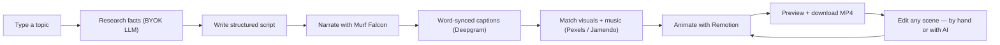
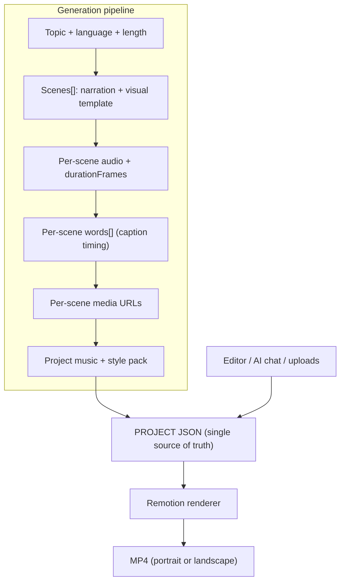
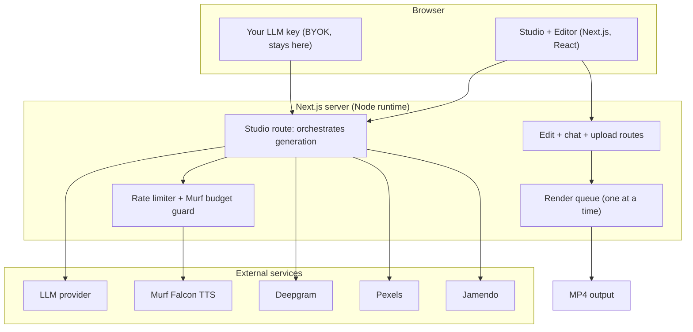

# 🎬 Reelify

**Turn a single topic into a finished, voiced, captioned video — in one click.**

Type a topic. Reelify researches it, writes a tight script, narrates it with a Murf Falcon voice, syncs word-level captions, matches each beat to stock visuals and music, animates it with Remotion, and hands you a downloadable MP4 — in portrait (9:16) or landscape (16:9). Then refine any scene by hand, swap in your own photos and video clips, or just **edit it in plain language with the built-in AI assistant.**

Built for the **Murf Falcon Buildathon**.

---

## ✨ What makes it different

- **One click to a real video** — research → script → voice → captions → visuals → music → render, fully automated.
- **Bring your own LLM key (BYOK)** — choose Google, OpenAI, Anthropic, xAI, or Groq. Your key stays in your browser and is never stored on the server.
- **12 languages** with native scripts and selectable Murf Falcon voice personas.
- **A real editor, not a black box** — every scene is editable. Change on-screen text and narration, and watch the preview update live.
- **Edit with AI** — ask in plain language ("make the intro punchier", "shorten all captions") and review the changes before saving.
- **Your own media** — replace any stock photo or video with your own upload. Images are smart-cropped to the frame; video clips get a trim tool so you pick exactly the part to use.
- **Dynamic length** — generate anywhere from ~1 to ~5 minutes.
- **Credit-safe by design** — the Murf voice budget is enforced before any generation, so it can never be overspent.

---

## 🚀 How it works



A finished video is just a render of a **PROJECT JSON** object. Edit the JSON, re-render — the data model never changes, which is what makes editing safe and predictable.



---

## 🏗️ Architecture



---

## 🧰 Tech stack

| Layer | Choice | Why |
| --- | --- | --- |
| Framework | Next.js 16 (App Router, webpack) | Server routes + React UI in one app |
| Video | Remotion 4 | Programmatic, JSON-driven video rendering |
| Voice | Murf Falcon (streaming TTS) | High-quality narration, 12 languages |
| Captions | Deepgram nova-3 | Word-level timing (estimated fallback) |
| Script | Vercel AI SDK (BYOK: Google / OpenAI / Anthropic / xAI / Groq) | User chooses the model; key never leaves their browser |
| Stock media | Pexels (photos + b-roll) | Aspect-aware visuals per scene |
| Music | Jamendo + local fallback | Topic-matched, royalty-free soundtrack |
| Media processing | sharp + ffmpeg (ffmpeg-static) | Smart-crop images, trim/fit uploaded video |
| UI | GSAP + Three.js + Poppins | Warm, tactile landing + studio |
| Storage | JSON files on disk | Simple, single-instance project store |
| Deploy | Docker on Railway (always-on) | Long renders need a non-serverless host |

---

## 🏁 Getting started

**Prerequisites:** Node.js 20+ and the API keys below.

```bash
# 1. Install dependencies
npm install

# 2. Configure environment
cp .env.example .env.local      # then fill in your keys

# 3. Run in development
npm run dev                     # http://localhost:3000

# 4. Production build
npm run build && npm start
```

### Required keys (`.env.local`)

| Variable | Purpose | Required |
| --- | --- | --- |
| `MURF_API_KEY` | Falcon text-to-speech | Yes |
| `DEEPGRAM_API_KEY` | Word-level caption timing | Recommended (estimated fallback if absent) |
| `PEXELS_API_KEY` | Stock photos + b-roll | Yes |
| `JAMENDO_CLIENT_ID` | Background music | Optional (local fallback) |
| `MURF_CHAR_BUDGET` | Hard cap on Murf characters (default 95000) | Optional |

> **LLM keys are not server-side.** You paste your own provider key in the Studio UI; it stays in your browser (session by default, or saved locally if you opt in) and is sent only to your chosen AI provider to write the script.

---

## ✏️ Editing a video

After generating, open the editor from the preview to:

- **Rewrite on-screen text** (titles, captions, bullets, quotes) — free and instant in the preview.
- **Rewrite narration** — re-voices just that scene and re-syncs its captions (uses Murf credits; the budget guard protects you).
- **Swap media** — upload your own image (auto-fitted to the frame) or video (trim to the exact segment you want).
- **Edit with AI** — describe the change in plain language; the assistant proposes edits to the text only, which you review before saving.

Every edit flows through the same PROJECT-JSON → render path, so what you preview is what you download.

---

## 🎵 Music

Reelify pulls topic-matched, royalty-free music from **Jamendo**. For an offline fallback, drop your own royalty-free `.mp3` files into `public/music/` — the app uses them when Jamendo is unavailable. **No music files are bundled in this repo**, to avoid redistributing third-party audio; please use tracks you have the rights to.

---

## ⚠️ Honest notes & limits

- **Murf is a one-time character allowance.** The budget guard refuses any generation that would exceed `MURF_CHAR_BUDGET`, so it can't be overspent — but it also can't be refilled. Longer videos use more characters.
- **Storage is single-instance.** Projects are JSON files on disk; on an ephemeral host (like Railway's default filesystem) they live for the container's lifetime. Fine for a demo; add a persistent volume for long-term use.
- **One render at a time.** HD renders are memory-hungry, so renders run sequentially in a queue rather than in parallel.
- **Rendering is CPU-bound.** A ~5-minute HD video takes meaningfully longer than a quick ~1-minute draft.

---

## 📦 Deployment

Reelify ships with a `Dockerfile` (Node 22, Chrome Headless Shell libraries, production build) for **Railway** or any always-on Docker host. Set the environment variables in your host's dashboard — never bake secrets into the image. A serverless platform is **not** suitable, because renders exceed typical function time limits.

---

## 📄 License

See [`LICENSE`](./LICENSE).
